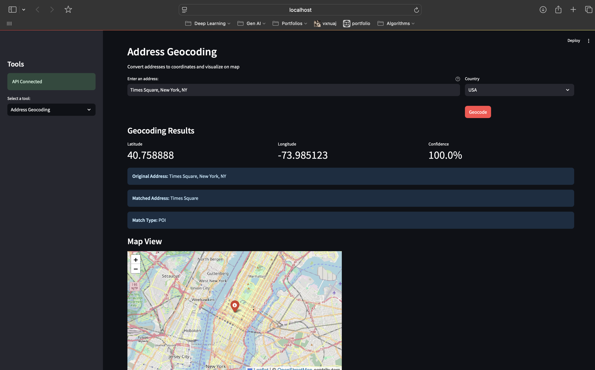
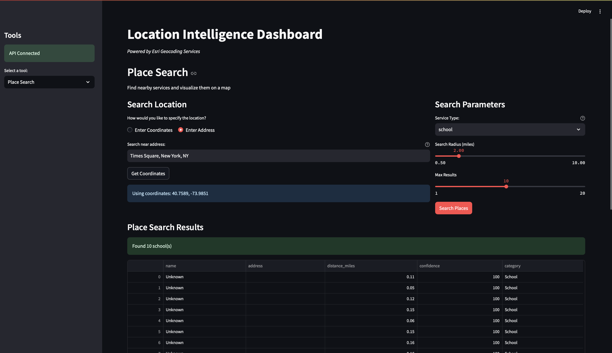

# Location Intelligence API

A comprehensive GIS API for location-based business intelligence using Esri services, featuring both a FastAPI backend and an interactive Streamlit dashboard.

##Features

- **Address Geocoding**: Convert addresses to geographic coordinates
- **Place Search**: Find nearby places and services
- **Demographics Analysis**: Get demographic data for locations
- **Route Planning**: Calculate optimal routes between points
- **Interactive Dashboard**: Web-based UI for exploring location data

## Installation

1. **Clone the repository**
   ```bash
   git clone https://github.com/dharmateja03/LocationIntelligenceApi.git
   cd location-intelligence-api
   ```

2. **Create a virtual environment**
   ```bash
   python -m venv venv
   source venv/bin/activate  # On Windows: venv\Scripts\activate
   ```

3. **Install dependencies**
   ```bash
   pip install -r requirements.txt
   ```

4. **Configure environment variables**
   ```bash
   cp .env.example .env
   # Edit .env with your Esri API credentials
   ```

### Starting the API Server

```bash
python -m uvicorn app.main:app --host 0.0.0.0 --port 8000 --reload
```

The API will be available at:
- **API Docs**: http://localhost:8000/docs
- **ReDoc**: http://localhost:8000/redoc
- **Health Check**: http://localhost:8000/health

### Starting the Streamlit Dashboard

```bash
streamlit run streamlit_app.py
```

The dashboard will be available at: http://localhost:8501

## 📁 Project Structure

```
location-intelligence-api/
├── app/
│   ├── __init__.py
│   ├── main.py                 # FastAPI application entry point
│   ├── config.py              # Configuration settings
│   ├── api/
│   │   └── endpoints.py       # API route definitions
│   ├── models/
│   │   └── schemas.py         # Pydantic data models
│   └── services/
│       └── geocoding.py       # Core geocoding service logic
├── streamlit_app.py           # Streamlit dashboard
├── requirements.txt           # Python dependencies
├── Dockerfile                 # Container configuration
├── .env                       # Environment variables
└── README.md                  # Project documentation
```

## API Endpoints

### Geocoding
- `POST /api/v1/geocode` - Convert address to coordinates
- `POST /api/v1/batch-geocode` - Process multiple addresses

### Place Search
- `POST /api/v1/places/search` - Find nearby places
- `GET /api/v1/places/categories` - Get available place categories

### Demographics
- `POST /api/v1/demographics` - Get demographic data for location

### Routing
- `POST /api/v1/route` - Calculate route between points

### Utility
- `GET /api/v1/health` - Health check endpoint

## Dashboard Features

The Streamlit dashboard provides an intuitive interface for:

### Address Geocoding Tool

*Convert addresses to coordinates with interactive map visualization*

### Place Search Tool

*Find nearby services like hospitals, restaurants, and gas stations*


## Usage Examples

### Geocoding an Address
```python
import requests

response = requests.post(
    "http://localhost:8000/api/v1/geocode",
    json={"address": "1600 Amphitheatre Parkway, Mountain View, CA"}
)
result = response.json()
print(f"Coordinates: {result['latitude']}, {result['longitude']}")
```

### Finding Nearby Hospitals
```python
response = requests.post(
    "http://localhost:8000/api/v1/places/search",
    json={
        "latitude": 37.4419,
        "longitude": -122.1430,
        "category": "hospital",
        "radius": 5000
    }
)
hospitals = response.json()
```

## Testing
# Test API endpoints manually
curl http://localhost:8000/api/v1/health
```

##Docker Deployment

```bash
# Build the image
docker build -t location-intelligence-api .

# Run the container
docker run -p 8000:8000 --env-file .env location-intelligence-api
```
##  Built With

- **[FastAPI](https://fastapi.tiangolo.com/)** - Modern Python web framework
- **[Streamlit](https://streamlit.io/)** - Interactive web apps for ML/data science
- **[Folium](https://python-visualization.github.io/folium/)** - Interactive maps
- **[Esri ArcGIS](https://developers.arcgis.com/)** - GIS and mapping services
- **[Pydantic](https://pydantic.dev/)** - Data validation using Python type hints

## Esri Endpoints Used:

  - Geocoding: https://geocode.arcgis.com/arcgis/rest/services/World/GeocodeServer
  - Routing: https://route-api.arcgis.com/arcgis/rest/services/World/Route/NAServer
  - Places: https://places-api.arcgis.com/arcgis/rest/services/places-service/v1
  - Demographics: https://geoenrich.arcgis.com/arcgis/rest/services/World/GeoenrichmentServer

---

